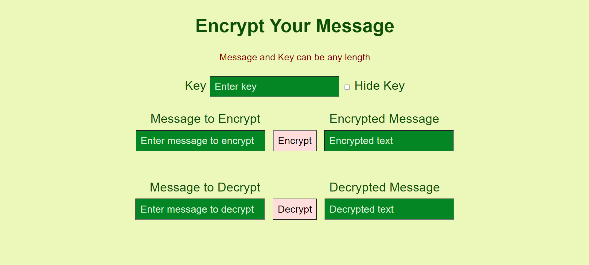
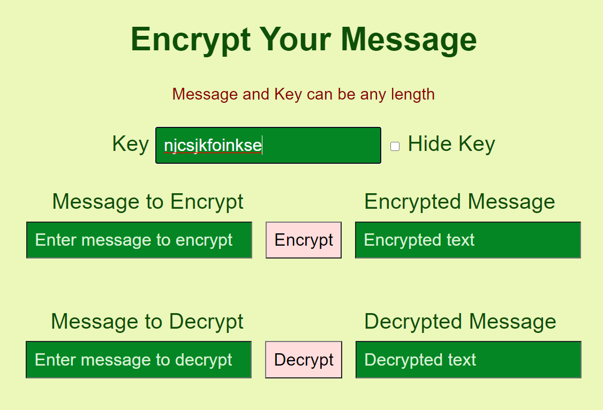
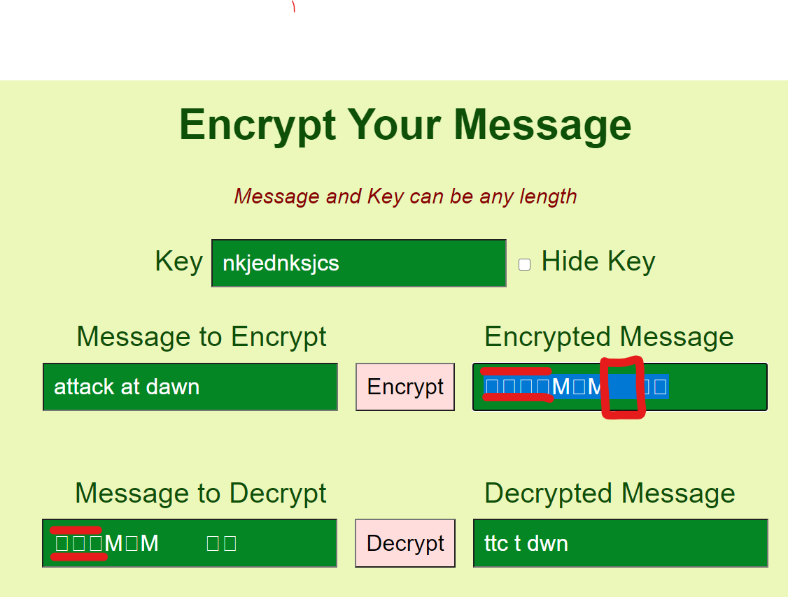

# Encryption/Decryption Program

This program can encrypt and decrypt messages using a key.  
The key and message have no character limit.

If you want, you can hide the key.

<i> There is currently an issue with the decryption part of the program</i>  
If the 'Encrypted Message' field has a 'blank space' character, then the clipboard does not properly copy
and paste it. This results in a different output for the decrypted message.  
An Example:

